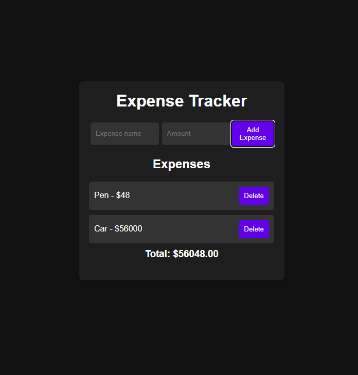

# 💰 Expense Tracker

A simple expense tracker built with **HTML, CSS, and JavaScript**.  
It allows you to add and delete expenses, while automatically calculating the total. Data is stored in **localStorage** so it persists after refresh.

---

## 🚀 Features
- Add and remove expenses
- Dynamic total calculation
- LocalStorage persistence
- Clean and minimal UI

---

## 🌍 Live Demo
🔗 [Hosted Link Here](https://rajdipchatterjee.github.io/Expense-Tracker-01/)

---

## 📸 Screenshot

---

## 🛠️ Tech Stack
- HTML
- CSS
- JavaScript
